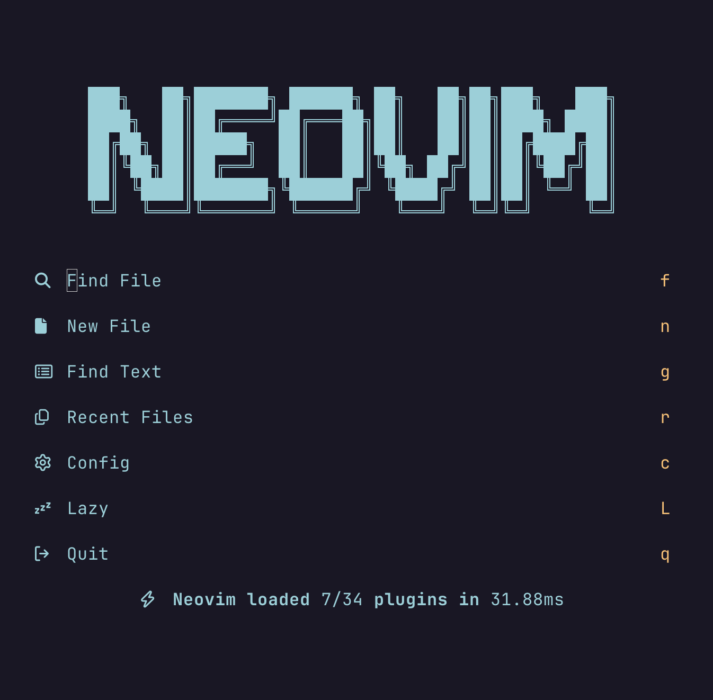

# nvim

This is my Neovim configuration.



## Install

### Prerequisites

- A terminal emulator that supports true colors. On macOS, you can install [Alacritty](https://alacritty.org/), [Ghostty](https://ghostty.org/), [kitty](https://sw.kovidgoyal.net/kitty/) or [WezTerm](https://wezfurlong.org/wezterm/index.html)
  For a full list of terminals that supports true colors, see [here](https://github.com/termstandard/colors?tab=readme-ov-file#terminal-emulators)
- A font that supports glyphs (icons). We can install a patched font from [Nerd Fonts](https://www.nerdfonts.com/)
- [fd](https://github.com/sharkdp/fd) - A simple and fast alternative to `find`, used by [fzf-lua](https://github.com/ibhagwan/fzf-lua)
- [ripgrep](https://github.com/BurntSushi/ripgrep) (rg) - A fast grepping tool that is used by several plugins, including [fzf-lua](https://github.com/ibhagwan/fzf-lua)

### Install Neovim

You can install Neovim on macOS using [Homebrew](https://brew.sh):

```sh
brew install neovim
```

Start Neovim by running `nvim` in the terminal. Once opened, all plugins will be automatically installed.

## Features

- Plugin manager - [lazy](https://github.com/folke/lazy.nvim)
- Theme - [Rose Pine](https://github.com/rose-pine/neovim)
- File explorer - [neo-tree](https://github.com/nvim-neo-tree/neo-tree.nvim)
- Fuzzy finder - [fzf-lua](https://github.com/ibhagwan/fzf-lua)
- File navigation - [harpoon](https://github.com/ThePrimeagen/harpoon/tree/harpoon2)
- Statusline - [lualine](https://github.com/nvim-lualine/lualine.nvim)
- Greeter - [snacks](https://github.com/folke/snacks.nvim)
- Keyboard shortcut hints - [which-key](https://github.com/folke/which-key.nvim)
- tmux window navigator - [vim-tmux-navigator](https://github.com/christoomey/vim-tmux-navigator)
- Autopairs - [nvim-autopairs](https://github.com/windwp/nvim-autopairs)
- Syntax highlighter and parser - [nvim-treesitter](https://github.com/nvim-treesitter/nvim-treesitter)
- Commenting - [Comment](https://github.com/numToStr/Comment.nvim)
- Git wrapper - [vim-fugitive](https://github.com/tpope/vim-fugitive)
- Git integration for buffers - [gitsigns](https://github.com/lewis6991/gitsigns.nvim)
- Indentation guides - [indent-blankline](https://github.com/lukas-reineke/indent-blankline.nvim)
- Package manager for LSP servers, DAP servers, linters and formatters - [mason.nvim](https://github.com/williamboman/mason.nvim)
- LSP server configurations - [nvim-lsp](https://github.com/neovim/nvim-lspconfig)
- Autocomplete engine and snippets - [blink](https://github.com/Saghen/blink.cmp)
- Code formatting - [conform](https://github.com/stevearc/conform.nvim)
- Debugger support - [nvim-dap](https://github.com/mfussenegger/nvim-dap) and [nvim-dap-ui](https://github.com/rcarriga/nvim-dap-ui)
