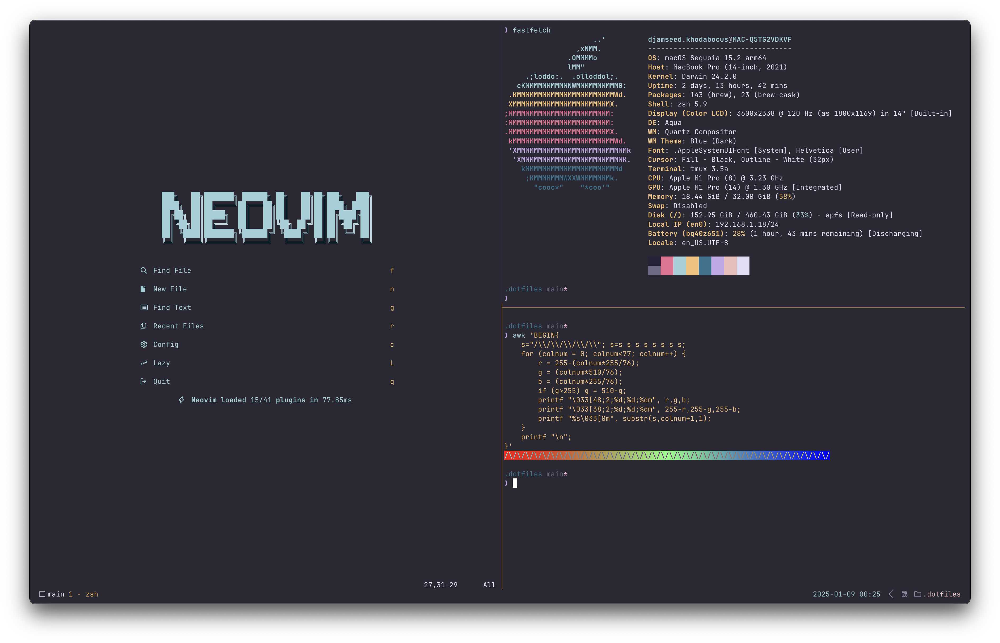

# dotfiles

Setup for my personal dotfiles and [Homebrew](https://brew.sh) packages. Works on \*nix, optimized for macOS.



My setup includes:

- [Aerospace](https://github.com/nikitabobko/AeroSpace)
- [Ghostty](https://ghostty.org)
- [Zsh](https://zsh.org)
- [Tmux](https://github.com/tmux/tmux)
- [Powerlevel10k](https://github.com/romkatv/powerlevel10k)
- [Neovim](https://neovim.io)
- [Jetbrains Mono Nerd Font](https://www.programmingfonts.org/#jetbrainsmono)

## Install

```sh
bash -c "$(curl -fsSL https://raw.githubusercontent.com/djamseed-khodabocus-cko/dotfiles/main/install.sh)"
```

This will install Homebrew packages and create symlinks from this repo to your home directory.

### Sensible macOS defaults

The install script will also run `macos.sh`, which provide sensible defaults when setting up a new Mac.

## Customizing

Update ~/.config/git/local/user with your email and name. It should look something like this:

```yaml
[user]
    email = john@example.com
    name = John Doe
```

Use a `.privaterc` file to save things (env vars, commands, etc...) you don't want to commit to a public repo.
It will be sourced if present. This can look something like that:

```sh
export SOME_API_KEY="f799a61172c44960a2ad2b297ed7475d"
```
